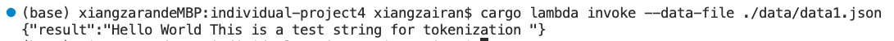
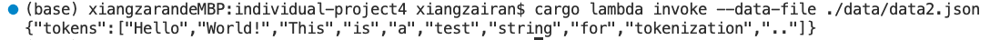
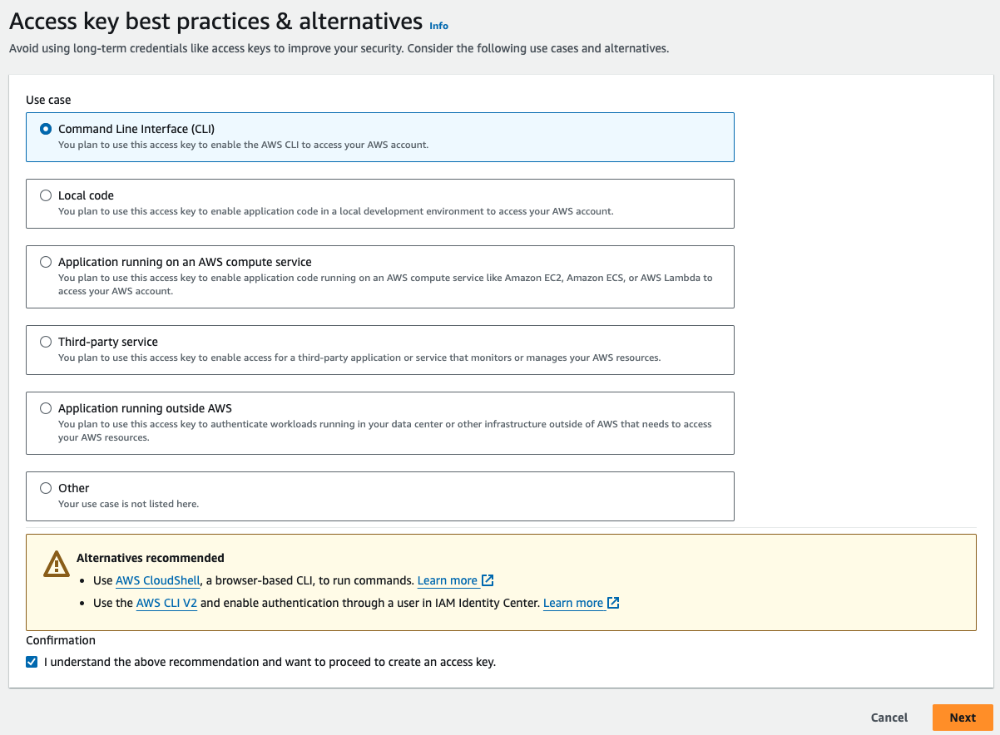
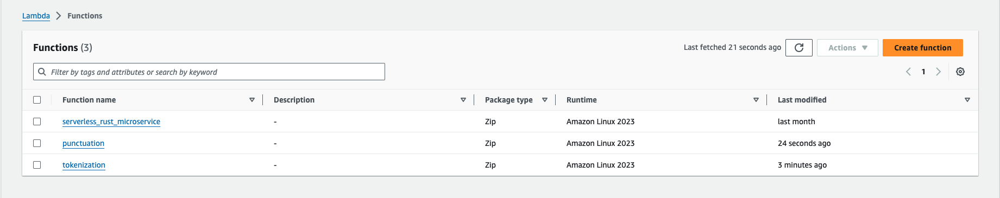
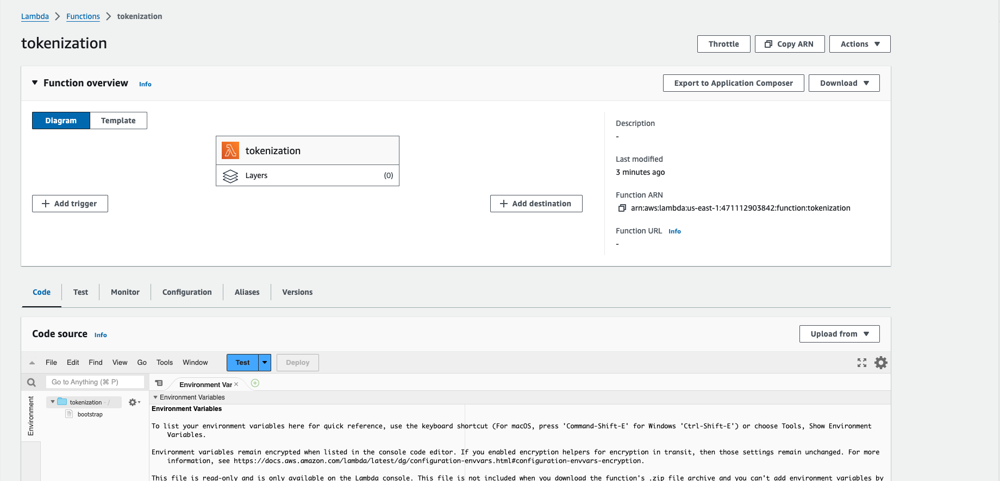
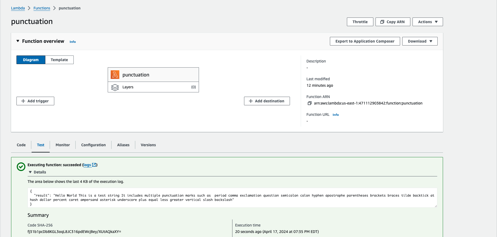
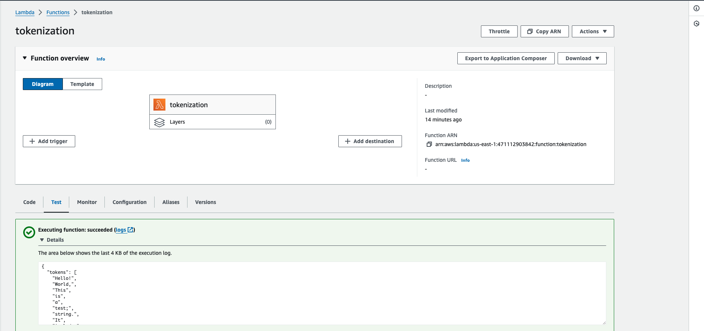
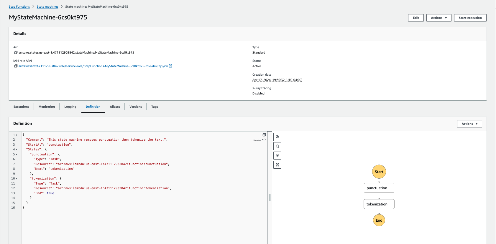
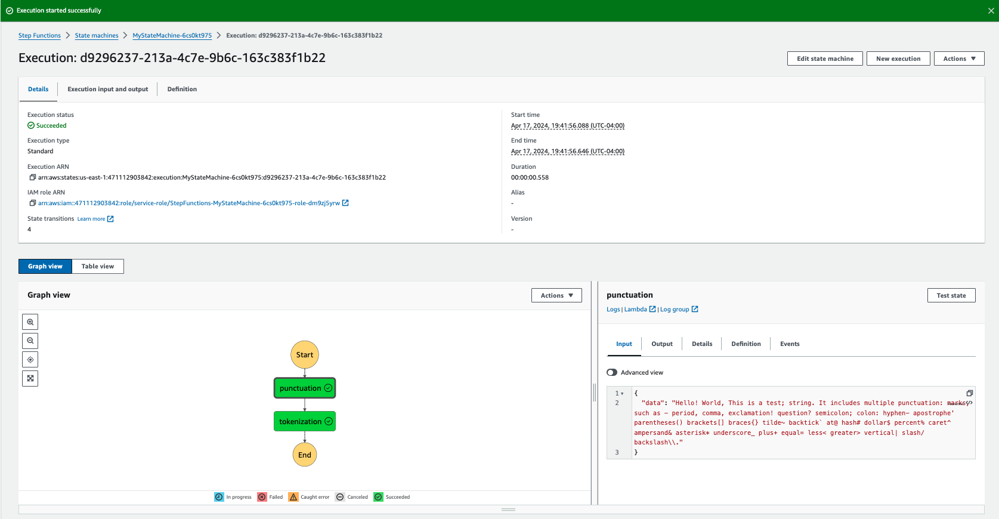

# Rust AWS Lambda and Step Functions

Zairan Xiang

## Project Overview

This project deployed develop a data processing pipeline using 2 Rust lambda functions on AWS Step functions framework. It developed a text data pre-processing pipeline using two lambda function: the punctuation function removes the punctuation from the input sentence and the tokenization function splits the sentence into words. 

- Rust AWS Lambda function
- Step Functions workflow coordinating Lambdas
- Orchestrate data processing pipeline

## Project Demo


## Steps:

### Rust Lambda Functions:
create two lambda functions to remove punctuation and tokenize the sentence

1. 
```bash
cargo lambda new punctuation
cargo lambda new tokenization
```

2. implement punctuation and tokenization in the corresponding main.rs files and add dependencies.

### Test Lambda Functions Locally

1. for each lambda function, do:
```bash
cd lambda_function_folder
cargo lambda watch
```

2. then open a new terminal window, in the project directory (not the lambda function directory),
```bash
cargo lambda invoke --data-file path_to_data_json_file
```
replace path_to_data_json_file with the path to the testing data.json file (the file that has the input senetence in it)

the result for testing punctuation and tokenization functions would looks like:



### Deploy the Lambda functions on AWS

1. follow similar instructions from min-project4 and mini-project5, create a new user with proper permissions assigned to this user. Choose CLI for Use case.


2. Under Security Sredentials section, generate an access key for API access. Then, set up environment variables so that cargo lambda knows which AWS account and region to deploy to by typing these two lines in the terminal inside each rust project directory:
```
export AWS_ACCESS_KEY_ID="your_access_key_here"
export AWS_SECRET_ACCESS_KEY="your_secret_key_here"
```

3. under each rust lambda function directory, 

Build the project by running `cargo lambda build --release`

Deploy the project by running `cargo lambda deploy`

Go to AWS Console and navigate to `Lambda`, inside `Function`: If cargo lambda deploy success, you may see the deployed lambda function on AWS, the lambda function should be ready and shown under the list




### Test Lambda Function on AWS
we can also test the functionalities of the lambda function in aws under the Test section:




### Data Pipeline with Step Functions

1. create new step function using the definition:

```json
{
  "Comment": "This state machine removes punctuation then tokenize the text.",
  "StartAt": "punctuation",
  "States": {
    "punctuation": {
      "Type": "Task",
      "Resource": "arn:aws:lambda:us-east-1:AWS_Account_ID:function:punctuation",
      "Next": "tokenization"
    },
    "tokenization": {
      "Type": "Task",
      "Resource": "arn:aws:lambda:us-east-1:AWS_Account_ID:function:tokenization",
      "End": true
    }
  }
}
```



2. test the data pipeline by clicking on start execution and input a text sentence in json format. The step function will first executes punctuation function to remove all punc from the sentence, then the results will be forwarded to be the input of the tokenization function, where it splits the sentence into words and output a list of words.


